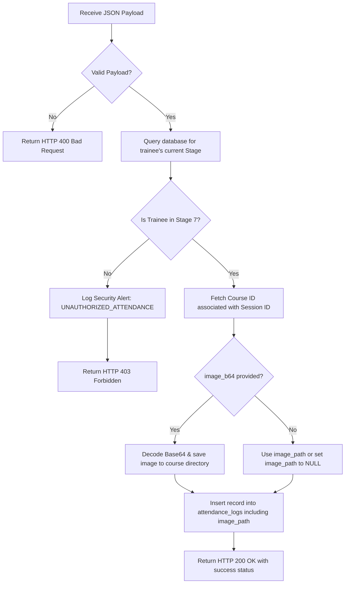

# Face Recognition Attendance Webhook Documentation

This documentation provides comprehensive details about the **AI Face Recognition Attendance Webhook** service integrated within the NTA Registration and Management Portal. Developers, system integrators, and smart hardware providers (such as IP cameras, biometric terminals, or tablet-based check-in apps) can use this guide to connect their devices to the NTA attendance gateway.

---

## 📡 Webhook Overview

The webhook operates as an inbound gateway on the NTA Super Admin backend. It runs 24/7, continuously receiving verified face recognition check-ins/check-outs from peripheral devices, automatically storing the captured photos into dedicated course folders, and recording the events directly in the core database.

### 🔗 Endpoint Details

*   **HTTP Method**: `POST`
*   **Default Endpoint URL**: `http://localhost:8003/api/attendance/webhook`
*   **Content-Type**: `application/json`
*   **Authentication**: Configurable via network firewall policies or proxy authorization (depends on network layout).

---

## 📥 Expected Request Payload

The webhook expects a JSON payload containing the trainee's identification, session identification, the confidence score from the face recognition model, the event type, and optional check-in photo details.

### JSON Field Specifications

| Field Name | Data Type | Required? | Default Value | Description |
| :--- | :--- | :--- | :--- | :--- |
| **`national_id`** | `string` | **Yes** | — | The 14-digit National ID of the trainee matching the recognized face. |
| **`session_id`** | `integer` | **Yes** | — | The unique ID of the training session the trainee is attending. |
| **`match_score`** | `float` | No | `0.0` | The confidence level of the face matching, between `0.0` and `1.0` (e.g., `0.98` for 98% confidence). |
| **`event_type`** | `string` | No | `"ENTER"` | The type of attendance event. Supported values: `"ENTER"` (Check-in), `"LEAVE"` (Check-out). |
| **`image_b64`** | `string` | No | — | Optional base64 encoded string containing the captured photo of the trainee during check-in/out. |
| **`image_path`** | `string` | No | — | Optional pre-saved path inside the file system if the image has already been copied to disk. |

### 📝 Example Payload with Base64 Image (Check-in)
```json
{
  "national_id": "29109141000018",
  "session_id": 42,
  "match_score": 0.957,
  "event_type": "ENTER",
  "image_b64": "data:image/jpeg;base64,/9j/4AAQSkZJRgABAQEASABIAAD/2wBDAP//////////////////////////////////////////////////////////////////////////////////////wgALCAABAAEBAREA/8QAFBABAAAAAAAAAAAAAAAAAAAAAP/aAAgBAQABPxA="
}
```

---

## ⚙️ Core Processing & Business Logic

When a payload hits the `/api/attendance/webhook` endpoint, the FastAPI server executes the following sequence:



### 1. Verification of Trainee State (Stage 7 Check)
To maintain security and prevent unauthorized or pre-mature check-ins, the webhook strictly verifies if the trainee is currently active in **Stage 7** of the NTA pipeline.
*   **Database Query**:
    ```sql
    SELECT p.current_stage_id FROM pipeline_state p
    JOIN users u ON u.id = p.trainee_id
    WHERE u.national_id = %s
    ```
*   **Action**: If the trainee is not found or their `current_stage_id` is NOT `7`, the request is **rejected** with a `403 Forbidden` response.

### 2. Auto-saving of Images in Course Directories
The system maps `session_id` to its corresponding `course_id` and automatically stores the check-in photo in the project directory:
*   **Folder Location**:
    *   **Check-ins**: `data/courses/<course_id>/attendance/`
    *   **Check-outs**: `data/courses/<course_id>/leave/`
*   **Naming Convention**: `{national_id}_{session_id}_{event_type}_{timestamp}.jpg`

### 3. Database Persistence
The event and the resulting relative photo path (e.g. `data/courses/42/attendance/29109141000018_42_ENTER_1780300000.jpg`) are saved to the database:
*   **Database Query**:
    ```sql
    INSERT INTO attendance_logs (national_id, session_id, event_type, match_score, image_path)
    VALUES (%s, %s, %s, %s, %s)
    ```

---

## 📤 Webhook Responses

### 🟢 200 OK (Success)
Returned when the check-in/check-out and photo are successfully processed and recorded.
```json
{
  "status": "success",
  "message": "Attendance (ENTER) recorded for 29109141000018",
  "image_path": "data/courses/42/attendance/29109141000018_42_ENTER_1780300000.jpg"
}
```

### 🔴 400 Bad Request (Missing Fields)
Returned if required parameters (`national_id` or `session_id`) are missing from the request body.
```json
{
  "detail": "Missing required fields: national_id or session_id"
}
```

### 🔴 403 Forbidden (Unauthorized Trainee State)
Returned if the trainee exists but is not currently active in Stage 7.
```json
{
  "detail": "Trainee not authorized for attendance (Stage 7 required)"
}
```

### 🔴 500 Internal Server Error (Database Error)
Returned if a database connection failure or query execution error occurs.
```json
{
  "detail": "Database persistence failed"
}
```

---

## 💻 How to Connect (Integration Examples)

Here are code snippets showing how external devices, cameras, or local client applications can push recognized face data along with photos to the webhook.

### 1. cURL / Shell
```bash
curl -X POST http://localhost:8003/api/attendance/webhook \
  -H "Content-Type: application/json" \
  -d '{
    "national_id": "29109141000018",
    "session_id": 42,
    "match_score": 0.965,
    "event_type": "ENTER",
    "image_b64": "iVBORw0KGgoAAAANSUhEUgAAAAEAAAABCAYAAAAfFcSJAAAADUlEQVR42mNk+M9QDwADhgGAWjR9awAAAABJRU5ErkJggg=="
  }'
```

### 2. Python (Requests Library)
```python
import requests
import base64

webhook_url = "http://localhost:8003/api/attendance/webhook"

# Base64 encode an image file to send
with open("test_photo.jpg", "rb") as image_file:
    encoded_string = base64.b64encode(image_file.read()).decode('utf-8')

payload = {
    "national_id": "29109141000018",
    "session_id": 42,
    "match_score": 0.965,
    "event_type": "ENTER",
    "image_b64": encoded_string
}

try:
    response = requests.post(webhook_url, json=payload, timeout=10)
    if response.status_code == 200:
        print("Successfully sent check-in:", response.json())
    else:
        print(f"Error {response.status_code}:", response.json().get("detail"))
except requests.exceptions.RequestException as e:
    print("Connection failed:", str(e))
```

### 3. JavaScript (Fetch API)
```javascript
const webhookUrl = 'http://localhost:8003/api/attendance/webhook';

// Sample tiny 1x1 black pixel base64 image data
const sampleBase64Image = "data:image/jpeg;base64,/9j/4AAQSkZJRgABAQEASABIAAD/2wBDAP//////////////////////////////////////////////////////////////////////////////////////wgALCAABAAEBAREA/8QAFBABAAAAAAAAAAAAAAAAAAAAAP/aAAgBAQABPxA=";

const payload = {
  national_id: '29109141000018',
  session_id: 42,
  match_score: 0.965,
  event_type: 'ENTER',
  image_b64: sampleBase64Image
};

fetch(webhookUrl, {
  method: 'POST',
  headers: {
    'Content-Type': 'application/json'
  },
  body: JSON.stringify(payload)
})
.then(response => {
  if (!response.ok) {
    return response.json().then(err => { throw new Error(err.detail); });
  }
  return response.json();
})
.then(data => console.log('Attendance logged successfully:', data))
.catch(error => console.error('Failed to log attendance:', error.message));
```

---
**Document Status**: *Production Ready (Active)*  
**System References**:
*   **Webhook endpoint**: `superadmin/backend/routers/attendance.py`
*   **Admin photo server**: `admin/backend/routers/admin.py`
